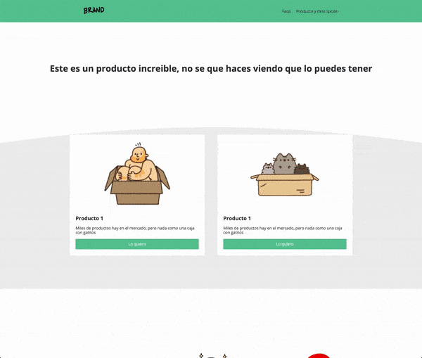

# Digital_product

## Overview
This project is a good practice to create modern looking web apps.  

## Features 
* Css Animations
* Css-Grid
* Use of Flex-box, Media Queries 
* Responsive Design 
* Form Validations using JavaScript 

#### LIVE LINK : https://jmoralesg.github.io/Digital_product/

## Tech Used / Dependencies
- Fonts from [Google Fonts](https://fonts.google.com/)
